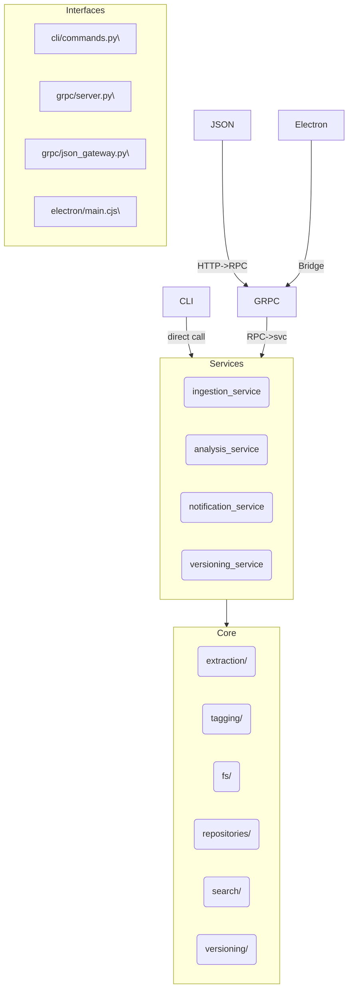

# AIchemist Archivum – Architecture

## Layers

| Layer | Responsibility | Depends on |
|-------|----------------|-----------|
| **core** | Pure domain code (no IO) | – |
| **services** | Orchestration / workflows | core |
| **interfaces** | Delivery mechanisms: CLI, gRPC, Electron | services |
| **config** | Pydantic settings, logging, rules, secrets | any |
| **utils** | Re-usable helpers (async IO, cache) | none |

### Interfaces detail

* **cli/** – Typer app → `python -m aichemist_archivum.interfaces.cli.commands`
* **grpc/** – `server.py` registers `FileManagerServicer` on :50051
    * bidirectional streams supported for large ingest events
    * `json_gateway.py` exposes REST on :8080 for non-gRPC clients
* **electron/** – `main.cjs` spawns the Python backend, loads Vite, and exposes safe APIs via `preload.cjs`.

### Threading & Async

* All heavy IO (disk, DB, embeddings) is `asyncio` or off-loaded with `to_thread`.
* gRPC **must** run inside the default event loop; Electron spawns it as a child process.

### Data Flow (ingest)

folder → core.extraction.* → core.tagging.* → repositories.* →
versioning.diff_engine → services.ingestion_service → storage (SQLite / vector DB)

See sequence diagrams in `docs/diagrams/` for full call traces.
